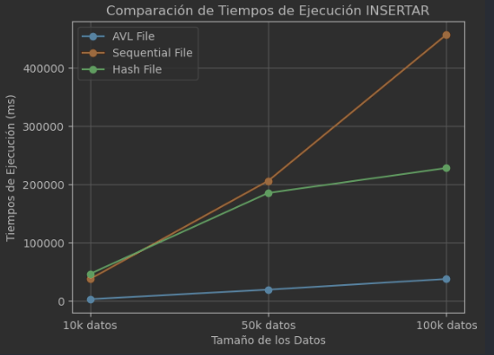
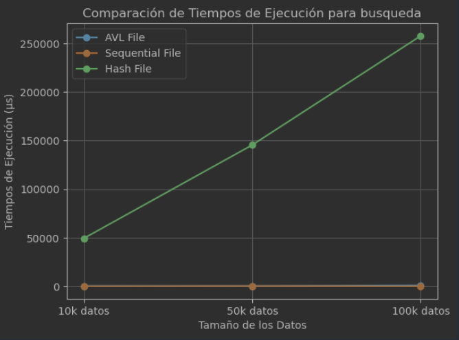
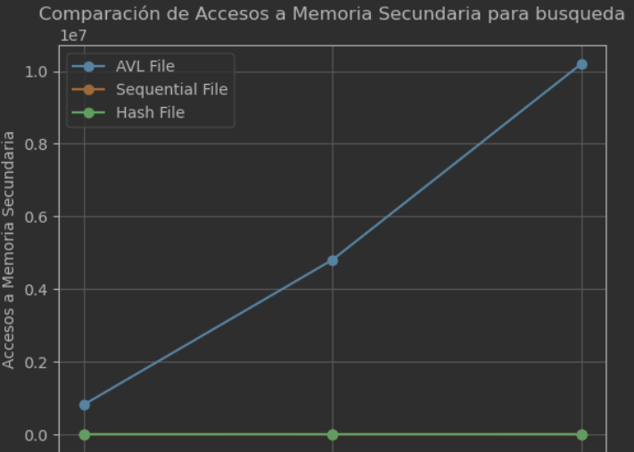

# BASE DE DATOS 2 - PROYECTO 1

## INTEGRANTES:

* Dimael Rivas [@artrivas](https://github.com/artrivas)
* Cahuana Condori, Kelvin AndreI [@andrewkc](https://github.com/andrewkc) 
* Chu
* Johan Callinapa
* Stuart Arteaga Montes [@SDAM26](https://github.com/SDAM26)

## 1. OBJETIVO
El objetivo de nuestro proyecto es implementar y comparar tres estructuras de organización de archivos para una recuperación y manipulación eficiente de datos. Las estructuras elegidas son:
* AVL file
* Sequential File
* Hash
Nuestras estructuras tendran las siguientes funciones :
* Buscar: dada una clave, devolveremos los registros respectivos.
* Búsqueda de rango: dado un rango de claves, devuelve todos los registros cuyas claves estén dentro del rango.
* Agregar: agrega un nuevo registro al archivo.
* Eliminar: eliminar un registro del archivo.
## 2. DATOS 
Datos sobre todos 548 jugadores de la NBA activos durante la temporada 2022-2023 obtenidos en [Kaggle](https://www.kaggle.com/datasets/szymonjwiak/nba-active-players-data-images)  que contiene los siguientes atributos:
| Atributo | Significado |
|-----------|-----------|
| playerid    | Id del jugador   |
|   fname  | Nombres    |
| lname    | Apellidos    |
| position    | Posicion de juego   |
| height     | Altura    |
| weight    | Peso    |
| birthday   | Cumpleaños    |
| Country    | Pais   |
| School    | Colegio    |
| Draft year    | Año de fichaje    |
## 3. Desempeño de las técnicas de indexación 
### AVL FILE:
AVL ofrece una mayor eficiencia en la búsqueda y manipulación de registros individuales, ya que es completamente dinámico. Esto lo hace más adecuado para aplicaciones donde se necesitan búsquedas de registros frecuentes y eficientes. Para aplicaciones que requieren búsquedas por rango de valores en la clave de índice, es particularmente útil.Aún así, reconocemos que ISAM puede ser más eficiente en términos de uso de memoria ya que no necesita almacenar toda la estructura del árbol como lo hace el archivo AVL.

#### Insercion
Antes de insertar el nodo en el avl, primero insertamos el récord en el HeapFile, de esta manera encontramos la posición física del registro, la cual servirá para la creación del nodo del avl. Siguiendo con esto, tenemos 3 casos:
  1. El archivo está vacío: Insertamos el nodo
  2. El root_node se encuentra eliminado: Reemplazamos el valor por el nodo a insertar
  3. Recorremos por medio de una recursión comparando un nodo comparativo y la llave
Enfocándonos en el 3er caso, tenemos que si el nodo no ha sido insertado anteriormente, se inserta normalmente. En caso de que no lo sea, se realiza un push_front en una lista enlazada anexada al nodo repetido (en el caso donde el atributo no sea primary_key). Luego por un proceso recursivo actualizamos la altura y balanceamos los nodos.

#### Busqueda
Por medio de una recursión encontramos el nodo con la llave deseada, y por medio de un bucle obtenemos todas los nodos con la misma llave por medio del atributo list pointer, luego los resultados se reemplazan por sus posiciones físicas en el heapfile (por medio del atributo file_position).

#### Remove
Utilizamos un lacy method para marcar nodos eliminados, cambiando el atributo file position a -1, y es debido a eso que por medio de comparaciones recursivas eliminamos el nodo en 3 casos:
  1. El nodo es hoja: Se retorna un -1 al puntero del padre
  2. El nodo tiene un hijo: Se retorna la posición del hijo al puntero del padre
  3. El nodo tiene 2 hijos: Se intercambian los valores entre el sucesor y el nodo a eliminar y se repite el proceso en el sub árbol derecho con la llave del sucesor.
Una vez ejecutado, se procede a actualizar las alturas y balancear los nodos. Note que no es necesario eliminar los nodos repetidos, ya que al eliminar al principal, las demás ocurrencias se pierden

#### Range Search
Se acota las búsquedas recursivas por medio de ambos limitadores, luego se procede a verificar si los nodos dentro del rango poseen repeticiones, para así extraerlos y reemplazarlos por sus valores físicos almacenados en el heapfile.

### Sequential File:
Un archivo secuencial es un archivo de datos donde los registros o entradas se almacenan de manera consecutiva, uno detrás del otro, en un solo flujo o secuencia de datos. Cada registro en el archivo tiene una longitud fija o variable. Lamentablemente debido a su naturaleza secuencial, el acceso a registros específicos dentro de un archivo secuencial puede ser lento, especialmente si se necesita acceder a un registro cercano al final del archivo.

#### Insercion
Si el archivo auxiliar (auxfile) llega a tener una cantidad k de registros, es esencial llevar a cabo un rebuild(). De no ser así, se inicia verificando el último SequentialBlock del datafile. Si la llave del registro actual es menor que la del registro a insertar, este último se añade al final del datafile, y se actualizan los punteros correspondientes. Si no es el caso, se procede a ubicar el espacio adecuado entre el datafile y el auxfile. El nuevo registro se anexa al final del auxfile y, si ya existe un registro con la misma llave, se retorna False. En cuanto a su complejidad, la inserción puede demandar un tiempo promedio de O(n/2).
#### Búsqueda 

El proceso de búsqueda puede variar. Para una búsqueda específica, se podría dividir el Archivo Secuencial en segmentos para identificar la llave, resultando en una complejidad de O(logn) + O(k), donde k es la longitud del auxfile. En búsquedas por rango, se localizan ambos extremos, inferior y superior, para obtener todos los registros entre esos valores. La técnica emplea tanto la búsqueda binaria en el datafile como la búsqueda lineal en el auxfile.

#### Eliminación

Para eliminar un registro, se busca la llave específica navegando tanto el datafile como el auxfile. Una vez identificada, se ajustan los punteros para reflejar la eliminación y se actualizan los registros afectados.

### Extendible Hashing 
Extensible Hashing es una técnica de organización de datos que se utiliza para indexar y buscar información en una estructura de datos jerárquica. Se basa en una función de hash que asigna datos a buckets, y cada bucket contiene un conjunto de registros relacionados. La característica distintiva del Extensible Hashing es que permite que el número de buckets aumente o disminuya dinámicamente a medida que se agregan o eliminan registros, lo que lo hace eficiente y escalable.

### 3.1.1. Inserción

### 3.1.2. Búsqueda

## 4. Interfaz gráfica
La interfaz fue desarrollado en el terminal de la consola.

## 5. Video Demostrativo
[Video Demostrativo](https://drive.google.com/drive/folders/1Dkh2F_ApZAGWXzrcB1O12xspLON71-JI?usp=sharing)
## 6. Conclusiones
El uso de estructura de datos en archivos facilita el ingreso a los registros de manera mas eficiente y menos compleja que la forma comun.
Durante la realización de nuestro proyecto universitario, que involucró el uso de estructuras de datos como los árboles AVL, el hashing extensible y los archivos secuenciales para gestionar datos, hemos adquirido conocimientos valiosos y experiencia en varias áreas:
* Árboles AVL:
Aprendimos que los árboles AVL son estructuras de búsqueda equilibradas que son excelentes para mantener datos ordenados.
Comprendimos cómo las rotaciones y equilibrios mantienen la estructura en óptimas condiciones para búsquedas eficientes.
Experimentamos con operaciones de inserción, eliminación y búsqueda en árboles AVL.
* Hashing Extensible:
Descubrimos que el hashing extensible es eficiente para búsquedas rápidas en conjuntos de datos grandes.
Exploramos cómo el tamaño de las tablas de dispersión se expande y contrae dinámicamente según sea necesario.
Aprendimos a manejar colisiones y cómo dividir o fusionar tablas de dispersión.
* Archivos Secuenciales:
Adquirimos habilidades prácticas en la gestión de archivos secuenciales, lo que es esencial en la ciencia de datos y la gestión de bases de datos.
Aprendimos a organizar datos de manera eficiente en disco y a realizar operaciones de lectura y escritura en archivos secuenciales.
* Consideraciones de Rendimiento y Eficiencia:
Reconocimos la importancia de evaluar el rendimiento y la eficiencia de cada estructura de datos en diferentes situaciones.
Comparamos operaciones de inserción, búsqueda y eliminación en árboles AVL, hashing extensible , Sequential File.
## 7. Referencias
* Estructura de datos : Archivos ( files ). (s. f.). https://www.fceia.unr.edu.ar/estruc/2006/fileintr.htm
* IBM documentation. (s. f.). https://www.ibm.com/docs/es/iis/11.5?topic=sets-structure-data
* rincondelvago.com. (2017, 30 abril). Encuentra aquí información de Estructura de datos: Acceso en ficheros para tu escuela ¡Entra ya! | Rincón del Vago. https://html.rincondelvago.com/estructura-de-datos_acceso-en-ficheros_1.html

